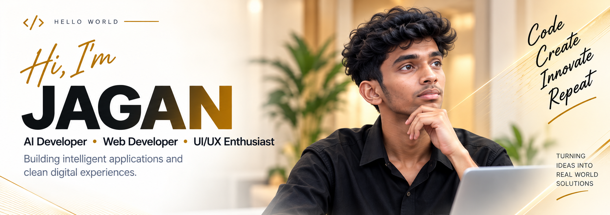

<!-- HERO SECTION -->

  
  
    
  
  <h3>AI Developer · Web Developer · UI/UX Enthusiast</h3>
  
Building intelligent applications, practical AI systems, and clean digital experiences.

  
   

  
  &nbsp;&nbsp;
  

  

##  ABOUT ME

I'm **Jagan**, an AI and Web Developer focused on building practical digital products.

I enjoy working across the full development process — from understanding a problem and designing the interface to developing the application and integrating AI capabilities.

**Currently working as an AI / Web Development Intern at Mintbook**, contributing to real-world digital products and improving my development skills through hands-on work.

### 🎯 WHAT I FOCUS ON
- 🤖 **AI & LLM Applications**
- 🧠 **RAG & Knowledge Systems**
- 💻 **Full-Stack Development**
- 🎨 **UI/UX Design**
- 🔌 **API Development**
- 🧊 **3D AI Avatars**

 

##  TECH STACK

  

 

##  FEATURED PROJECTS

> ### ✨ [Personal Portfolio & Jagan AI](https://jagandev.me)
> Responsive personal portfolio featuring an embedded **Jagan AI assistant** trained specifically to answer questions about my background and skills.
>  **Tech:** HTML · CSS · JS · PHP · MySQL · AI/LLM

> ### 🛍️ [Glowist AI Beauty E-Commerce](https://jagandev.me/glowist)
> Beauty e-commerce platform featuring **AI product recommendations** and a camera-based **AR virtual makeup** try-on experience.
>  **Tech:** HTML · CSS · JS · PHP · AI/ML · AR

> ### 🍽️ [QR Restaurant Menu & Billing](https://jagandev.me/Resturant/?table=1)
> Web-based restaurant management system combining a QR digital menu, live customer ordering, and an administrative billing dashboard.
>  **Tech:** HTML · CSS · JS · PHP · MySQL

> ### 🗳️ [Online Voting System](https://jagandev.me/voterid_app)
> Digital voting platform featuring **real OTP verification**, voter authentication, secure vote casting, and result management.
>  **Tech:** HTML · CSS · JS · PHP · MySQL

> ### 👗 [Outfits - Fashion E-Commerce](https://jagandev.me/E-commerce)
> Live e-commerce platform for clothing featuring real-time **Razorpay integration** and a full admin dashboard for product management.
>  **Tech:** React · Node.js · MongoDB · Razorpay

> ### 🏥 [HealthSync AI/ML](https://jagan0512.streamlit.app/)
> Healthcare application using supervised machine learning to analyze user symptoms and BMI to provide early indications of health conditions.
>  **Tech:** Python · Machine Learning · Streamlit

> ### 🤖 [Sara — AI Avatar](https://jagandev.me)
> A 3D AI avatar experience designed for interactive communication with facial expressions and VRM-based web integration.
>  **Tech:** Blender · VRM · Three.js

> ### 🧠 [Personal AI / RAG System](https://jagandev.me)
> An offline AI question-answering system designed to retrieve relevant knowledge and generate grounded responses.
>  **Tech:** Python · FastAPI · FAISS · LLM

> ### ✈️ [Flight Booking UI/UX](https://www.figma.com/design/cVPk5t8PGxVJcYsxWTfLGp/official-web)
> Modern UI/UX design for a Flight Booking Website with a seamless search interface, user flow, and interactive prototype.
>  **Tech:** Figma · UI/UX Design

> ### ☕ [Coffee Delivery UI/UX](https://www.figma.com/design/xmJHCymyKN4JBYGvwJY4B4/Coffee-shop-delivery-app)
> UI/UX design for a Coffee Delivery app focusing on clean product presentation, cart workflow, and an engaging interface.
>  **Tech:** Figma · UI/UX Design

 

##  EXPERIENCE

> ### Mintbook
> **AI & Web Development Intern (Onsite)** | *Jun 2026 — Sep 2026*
> - Worked on AI development tasks involving LLMs and AI-powered applications.
> - Developed and optimized 3D characters and avatars for interactive applications.
> - Worked with AI, 3D modeling, rigging, facial expressions, and avatar integration.

> ### ILife Technology
> **UX/UI Designer Intern (Onsite)** | *Jan 2025 — Apr 2025*
> - Designed and improved responsive web and mobile interfaces.
> - Created wireframes, prototypes, and high-fidelity designs.
> - Collaborated with developers to ensure smooth handoff and usability.

 

##  GITHUB ACTIVITY

  
    
  

  

##  CURRENTLY EXPLORING

- 🚀 **AI Engineering:** Building practical AI-powered applications.
- 🧠 **RAG & LLM Apps:** Exploring retrieval and grounded generation.
- 🧊 **3D AI Avatars:** Working with VRM, Blender and Three.js.
- 💻 **Full-Stack Dev:** Building complete web applications.
- 🎨 **UI/UX Systems:** Designing clean and usable interfaces.
- 💡 **Product Development:** Turning ideas into real-world solutions.

  

<!-- BUILDING TOWARD SECTION -->

  <h2>WHAT I'M BUILDING TOWARD</h2>
  <h3>Code &rarr; Create &rarr; Innovate &rarr; Repeat</h3>
  
<i>I'm continuously working toward building intelligent products that are technically strong, useful, and simple to use.</i>

  

##  LET'S CONNECT

Have an idea, project, or opportunity? Let's build something useful.

  
  &nbsp;&nbsp;
  

  

<!-- FOOTER -->

  
<small>Designed & built by Jagan</small>

